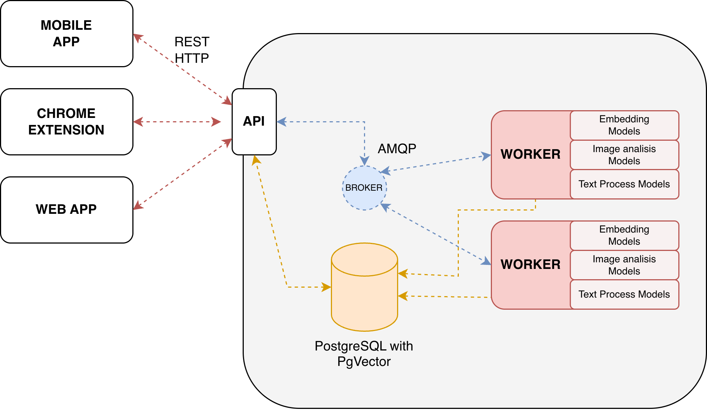

# 📦 Things - Just Things

> **Organize your mind, one thing at a time.**

Things is an open-source project focused on facilitating organization and mental tranquility for users. It allows you to organize and store information of interest to retrieve it when the moment truly matters.

Created by **LleidaHackers Team** at **HackUDC** 🚀

---

## 🌟 What is Things?

Things helps you capture and organize information without the mental burden of remembering everything. Save what matters now, retrieve it when you need it — simple, efficient, and stress-free.

---

## 🏗️ Architecture

Things consists of three main components:

### 📱 [Mobile App](https://github.com/LLEIDAHACKERS/things-frontend)
Native mobile application for iOS and Android to manage your things on the go.

### 🧩 [Browser Extension](https://github.com/LLEIDAHACKERS/things-extension)
Browser extension to quickly save content from the web directly to your Things collection.

### ⚙️ [Backend](https://github.com/LLEIDAHACKERS/things-backend)
API and data management system powering the entire Things ecosystem.

---

## 📐 System Architecture

---

## 🤝 Contributing

We welcome contributions! Please check out our [CONTRIBUTING](CONTRIBUTING) guide to get started.

---

## 📄 License

This project is licensed under the terms specified in the [LICENSE](LICENSE) file.

---

## 💬 Community

- **Issues & Discussions**: Use this repository for project-wide issues, feature requests, and discussions
- **Roadmap**: Check our [Projects](../../projects) tab for upcoming features and milestones

---

  Made with ❤️ by <a href="https://github.com/LLEIDAHACKERS">LleidaHackers</a>

